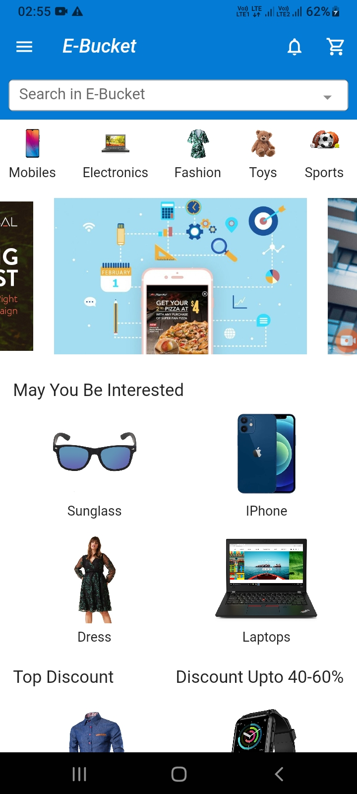
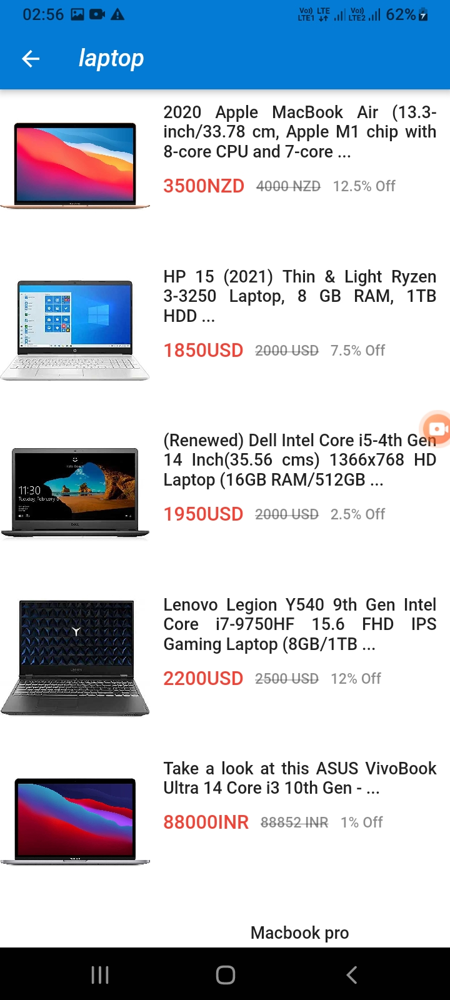
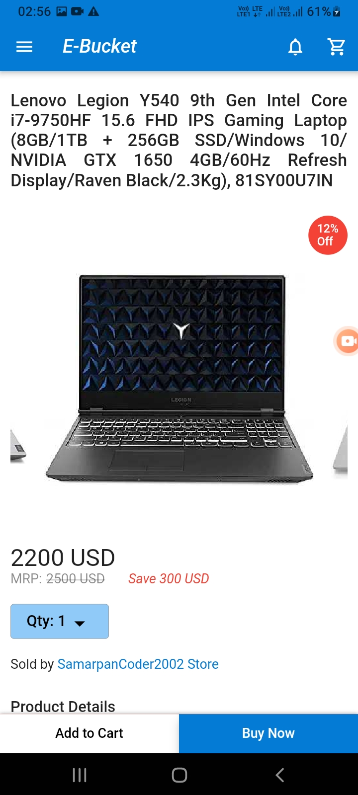

### 
E-Bucket

#### 
 An E-Commerce App Clone Made In Flutter With Firebase

    
    
    

<h3 align="center">Show 💘 by Starring This Repo</h3>

- #### [Click Here to See the Project Video](https://youtu.be/3wP8md_vIrM)

- #### [App Download Url]()

- #### [Follow me on LinkedIn To get Regular Project Updates](https://www.linkedin.com/in/samarpan-dasgupta-4aa1061b0/)

<h3 align="center"><b>🧡 Thank You For Visiting 🙏, Have a Nice Day 🧡</b></h3>

## Getting Started

This project is a starting point for a Flutter application.

A few resources to get you started if this is your first Flutter project:

- [Lab: Write your first Flutter app](https://flutter.dev/docs/get-started/codelab)
- [Cookbook: Useful Flutter samples](https://flutter.dev/docs/cookbook)

For help getting started with Flutter, view our
[online documentation](https://flutter.dev/docs), which offers tutorials,
samples, guidance on mobile development, and a full API reference.
